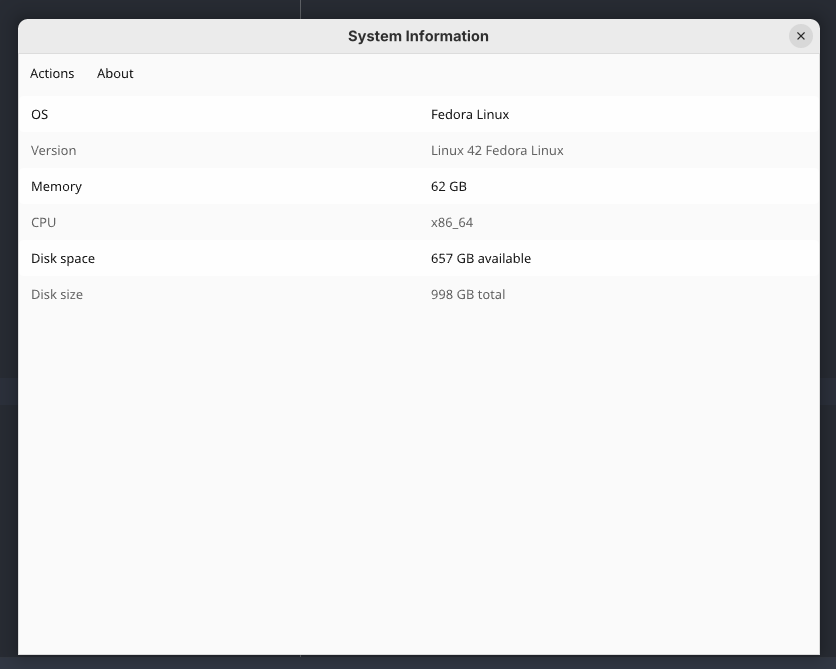

## System Info 

This is a demo project built with Rust and Slint to explore the capabilities 
of creating a native application in Rust without using Electron.

The basic idea is to create an app with a main app window and a few menu bar 
items to control the application.

